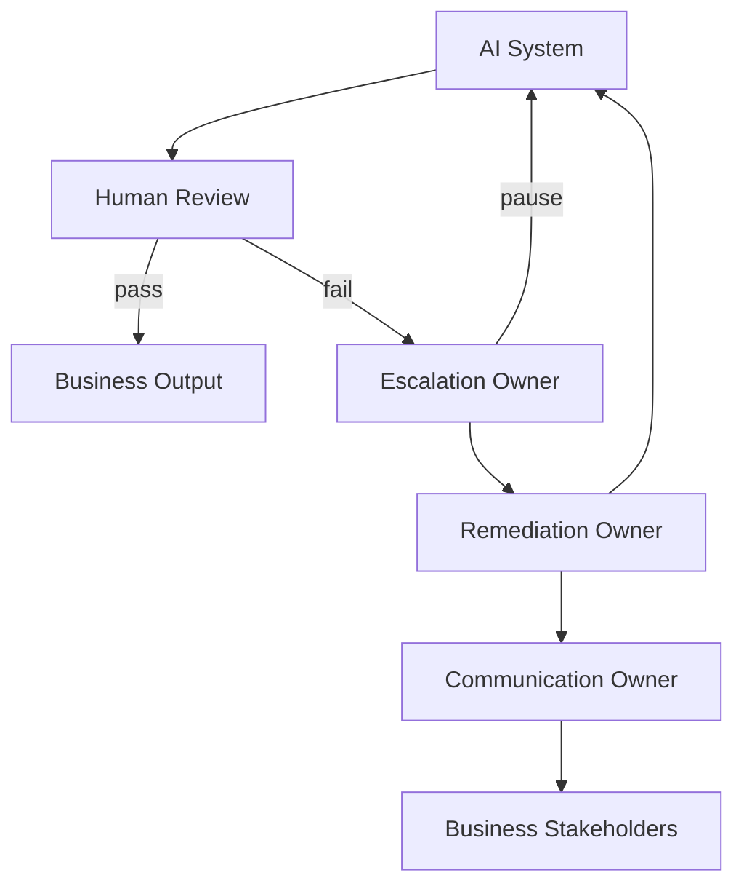

# Governance Lifecycle Architecture

## Pilot → Governance Gap → Production

```mermaid
flowchart LR
    subgraph PILOT["[ PILOT ]"]
        P1[Limited scope]
        P2[Manual review]
        P3[Supportive users]
        P4["Q: Model accurate enough?"]
    end

    subgraph GAP["[ GOVERNANCE GAP ]"]
        G1[Who reviews?]
        G2[Who pauses?]
        G3[Who fixes?]
        G4[Who communicates?]
        G5[Ownership undefined]
    end

    subgraph PROD["[ PRODUCTION ]"]
        PR1[Real users]
        PR2[No review buffer]
        PR3[Business impact]
        PR4["Q: Who owns impact?"]
    end

    PILOT --> GAP --> PROD
```

## Ownership model (target state)

## Control layers

| Layer | Control | Owner |
|-------|---------|-------|
| Input | Data boundary, PII filtering | Security / Data |
| Model | Accuracy thresholds, guardrails | ML / Platform |
| Output | Human review, approval gates | Business / Ops |
| Operations | Audit log, cost monitoring | Platform Engineering |
| Incident | Runbook, escalation, rollback | TPM / SRE |
