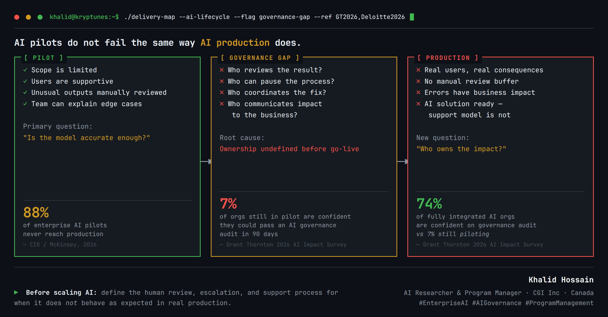

# Enterprise AI Governance

**Decision framework:** Why AI pilots fail differently than AI production — and what to define before go-live.

| | |
|---|---|
| **Type** | Decision Framework |
| **Audience** | CIO, CTO, VP Engineering, TPM, Enterprise Architect |
| **Status** | Live — 2026-07-02 |
| **Insights URL** | [kryptunes.com/insights/enterprise-ai-governance-pilot-production-gap](https://kryptunes.com/insights/enterprise-ai-governance-pilot-production-gap) |

## Quick verdict

- In **pilot**, the question is model accuracy. In **production**, the question is impact ownership.
- **88%** of enterprise AI pilots never reach production (McKinsey/CIO, 2026).
- Only **7%** of orgs still piloting are confident they'd pass an AI governance audit in 90 days (Grant Thornton 2026).
- **74%** of fully integrated AI orgs are confident on governance audit readiness.
- **Root cause of the gap:** ownership undefined before go-live — who reviews, pauses, fixes, and communicates?

## Contents

| Folder | What's inside |
|--------|---------------|
| [article.md](article.md) | Full decision framework (syncs to Strapi /insights) |
| [Slides/](Slides/) | Terminal-style deck (HTML + PNG) |
| [Research/](Research/) | Research notes |
| [Architecture/](Architecture/) | Governance architecture diagram |
| [Implementation/](Implementation/) | RACI, controls, sample runbook |
| [Checklist/](Checklist/) | Pre-production governance checklist |
| [Templates/](Templates/) | ADR and escalation templates |
| [References/](References/) | Citations |

## Slide preview

